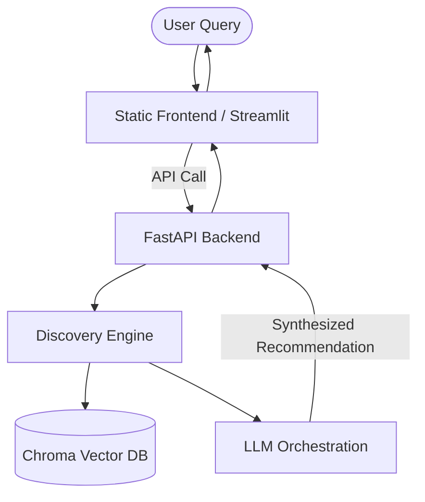

# Spotify AI-Powered Review Discovery Engine: MVP Documentation

This document outlines the design, features, and technical architecture of the Minimum Viable Product (MVP) developed for the **Spotify Review Discovery Engine**. It highlights why Artificial Intelligence is uniquely positioned to solve the challenges of modern music discovery.

---

## 1. The Core Problem & The AI Advantage

### The Problem
Traditional music recommendation engines suffer from **repetition fatigue** and **keyword rigidity**:
1.  **Algorithmic Bubbles**: Recommendation algorithms repeatedly loop the same 15-20 tracks because collaborative filtering relies heavily on historical play counts, preventing users from discovering new music.
2.  **Lack of Semantic Context**: Conventional search functions require users to type exact genres, artists, or titles. They cannot parse abstract queries like *"chill lofi beats with warm acoustic guitar for a rainy Sunday study session."*
3.  **Static Interfaces**: Traditional search filters require users to check boxes (BPM, release date, genre) instead of steering their recommendations conversationally.

### Why AI is Uniquely Suited to Solve It
AI models provide three unique capabilities that resolve these limitations:
*   **Dense Vector Embeddings**: Embeddings translate human descriptions (moods, vibes, activities) and audio characteristics (tempo, energy, acousticness) into high-dimensional vector spaces. This enables semantic similarity searches that match the *feeling* of a query to the *profile* of a track, bypassing exact string matches.
*   **Large Language Models (LLMs)**: LLMs understand natural language semantics. They act as translators, converting a user's conversational request into structured parameters (e.g., mapping *"speed it up"* to an increase in tempo constraints).
*   **Agentic Loops**: An agentic system maintains session state and reasons over user feedback. When a user requests refinements (e.g., *"keep it lofi, but add more vocals"*), the agent dynamically reformulates search parameters, executing stateful conversational discovery.

---

## 2. MVP Features & Product Concept

The MVP consists of the **Review Discovery Assistant**, which is exposed via two prototype interfaces:
1.  **Production Web Dashboard (`src/frontend`)**: A visually polished, responsive interface running on a FastAPI backend.
2.  **Agentic Playground (`src/phase4/app.py`)**: A Streamlit dashboard demonstrating stateful conversational search.



### Core MVP Capabilities
*   **Natural Language Semantic Discovery**: Users type natural prompts (e.g., *"Late night drive music with deep bass"*). The engine queries a vector database seeded with 2,000+ tracks to return semantically matching results.
*   **Voice of the Customer (VoC) Contextual Summaries**: The engine combines track listings with analyzed user review insights (e.g., sentiment data, user complaints) to explain *why* it recommends these tracks and how they address common user frustrations.
*   **Stateful Chat Refinement**: Users can click or type refinements. The feedback agent processes the refinement (e.g., *"Make it higher energy"*), updates the active parameters, and adjusts the recommendation list dynamically.
*   **Spotify Playlist Synchronization**: The app connects to the Spotify Web API, letting users instantly export their discovered tracks as sync'd playlists.

---

## 3. Technical Architecture

*   **Vector Database (ChromaDB)**: Stores track embeddings generated from audio features (tempo, energy, danceability, acousticness, valence) and descriptive text profiles.
*   **LLM API (Groq/OpenAI)**: Processes natural language intents, extracts structured filter variables, and synthesizes final recommendations.
*   **FastAPI Production Backend (`src/backend/main.py`)**: Exposes REST API endpoints:
    *   `/api/v1/discover` (Initial semantic search)
    *   `/api/v1/discover/refine` (Agentic session refinement)
*   **Static HTML/CSS/JS Frontend (`src/frontend/`)**: Production-ready visual layer utilizing a premium dark Spotify-aesthetic, fully responsive for desktop and mobile viewports.

---

## 4. How to Run the MVP

To launch the full MVP pipeline locally, follow these steps:

### Prerequisites
Ensure your `.env` contains your LLM credentials (e.g., `GROQ_API_KEY` or `OPENAI_API_KEY`) and Spotify API credentials if syncing playlists.

### Step 1: Seed the Vector Database
Initialize the Chroma Vector Database with the tracks catalog:
```powershell
python src/phase4/seed_tracks.py
```

### Step 2: Start the FastAPI Backend Server
Launch the backend server on port `8081`:
```powershell
python src/backend/main.py
```

### Step 3: Run the Web Frontend Dashboard
Serve the static frontend on port `8080` (or open the files directly):
```powershell
python -m http.server 8080 --directory src/frontend
```
Open [http://localhost:8080/](http://localhost:8080/) in your web browser.

### Step 4: Run the Streamlit Agent Playground (Optional)
To test the stateful conversational agent loop in Streamlit, run:
```powershell
streamlit run src/phase4/app.py --server.port=8501
```
Open [http://localhost:8501/](http://localhost:8501/) in your web browser.
