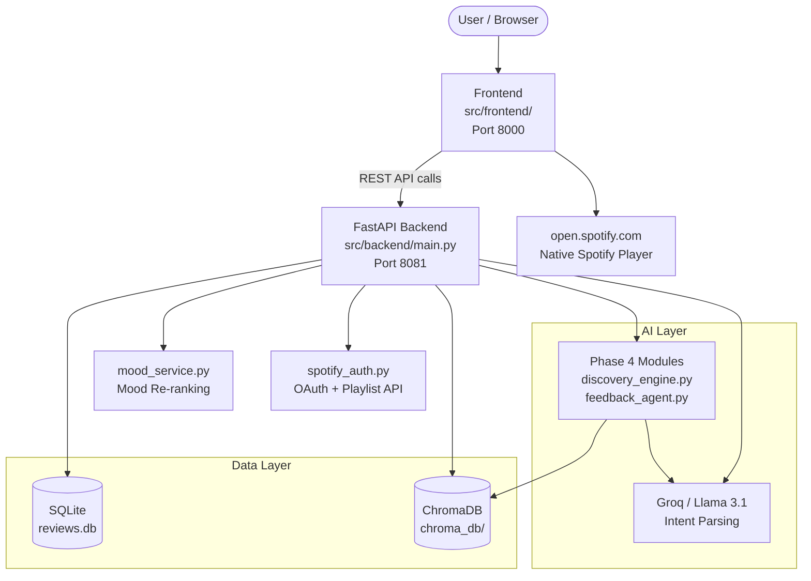

# Spotify AI-Powered Review Discovery Engine: MVP Documentation

This document reflects the **current, fully-deployed state** of the Spotify Review Discovery Engine MVP. It covers all active phases of development, the complete REST API surface, and the technical components in production.

---

## 1. The Core Problem & The AI Advantage

### The Problem
Traditional music recommendation engines suffer from **repetition fatigue** and **keyword rigidity**:
1. **Algorithmic Bubbles**: Collaborative filtering repeatedly loops the same 15–20 tracks based on historical play counts, starving users of genuine discovery.
2. **Lack of Semantic Context**: Conventional search requires exact genre/artist/title input — it cannot parse abstract queries like *"chill lofi beats with warm acoustic guitar for a rainy Sunday study session."*
3. **Static Interfaces**: Traditional filters (BPM checkboxes, release-date sliders) cannot capture conversational intent or mood-based steering.
4. **Taste Pollution**: Shared accounts or exploratory listening permanently skews a user's recommendation model with no sandbox escape.

### Why AI is Uniquely Suited to Solve It
| Capability | How It's Used in This MVP |
|---|---|
| **Dense Vector Embeddings** | Track audio features + text descriptions are embedded in ChromaDB for semantic similarity search |
| **Large Language Models (LLMs)** | Groq-hosted Llama 3.1 parses natural-language intent into structured filter parameters |
| **Agentic Session Loops** | Session state maintains conversation history across refinement turns |
| **Rules-Based Hybrid** | Dual-path analysis (LLM + rule engine) ensures graceful degradation without an API key |

---

## 2. Current Feature Set

### 2.1 Review Intelligence Pipeline (Phases 1–3)

Multi-platform review data is ingested, cleaned, LLM-analyzed, and exposed for stakeholder export.

| Stage | What Happens |
|---|---|
| **Ingest** (`POST /api/v1/ingest`) | Scrapes Apple App Store & Google Play; generates Reddit/Twitter mocks |
| **Analyze** (`POST /api/v1/analyze`) | LLM (Groq/Llama) or rules engine tags each review with `sentiment`, `topic`, and `score` |
| **Insights** (`GET /api/v1/insights`) | Returns sentiment/topic breakdowns and negative sample quotes |
| **Export** (`POST /api/v1/export`) | Writes a full Markdown insights report + email memo to `data/workspace/` (or via MCP) |

**Review Topics Classified:**
- Algorithmic Bubble / Recommendation Repetition
- Smart Shuffle loop issues
- Taste pollution / Lack of Sandbox mode
- Decision overload
- General Feedback / Other

---

### 2.2 AI Music Discovery — Conversational Mode (Phase 4)

Users type a free-form natural language query. The backend parses intent via LLM, queries the ChromaDB vector database seeded with **~180 curated tracks**, and returns semantically ranked results with an LLM-generated explanation.

| Endpoint | Purpose |
|---|---|
| `POST /api/v1/discover` | Initial semantic search from natural language query |
| `POST /api/v1/discover/refine` | Stateful refinement (e.g. *"make it higher energy"*) |

**Flow:**
```
User Query → LLM Intent Parser (Groq) → ChromaDB Semantic Search
    → [Optional] Spotify Preview URL Enrichment
    → LLM Explanation Generator → JSON Response
```

The session is persisted in-memory (`_discovery_sessions`) keyed by `session_id`, enabling multi-turn conversation history.

---

### 2.3 Wanderer Mode — Bubble-Breaking Discovery (Phase 4+)

A dedicated discovery mode that **explicitly excludes the user's listening history** from search results to break algorithmic echo chambers. Each track includes a plain-language **reason** field explaining *why* it was selected.

| Endpoint | Purpose |
|---|---|
| `POST /api/v1/wanderer/discover` | Bubble-free discovery; excludes previously heard tracks |
| `POST /api/v1/wanderer/refine` | Stateful refinement within Wanderer session |

---

### 2.4 Mood-Based Catalog & Personalization (Phase 5)

An independent mood engine serves curated song catalogs organized by emotional category with real-time re-ranking based on user listening behavior (Wilson Score confidence intervals on feedback signals).

| Endpoint | Purpose |
|---|---|
| `GET /api/v1/moods` | List all available moods with display metadata & gradients |
| `GET /api/v1/moods/{mood}/songs` | Ranked song catalog for a mood (supports personalization) |
| `POST /api/v1/songs/{song_id}/mood-feedback` | Log thumbs-down feedback; triggers immediate re-rank |
| `POST /api/v1/songs/{song_id}/listen` | Log a listening event for a song (by ID) |
| `POST /api/v1/listen-log` | Log a listening event by track name + artist |
| `POST /api/v1/moods/rebuild` | Force-rebuild all mood catalogs and caches |

Mood definitions, audio-feature thresholds, and gradient colors are declared in `src/backend/mood_config.json`.

---

### 2.5 Spotify OAuth & Native Player Integration

Full Spotify Web API integration using Authorization Code OAuth 2.0. Falls back to **mock mode** automatically when credentials are not configured.

**Scopes:** `playlist-modify-public`, `playlist-modify-private`, `user-read-private`, `user-read-playback-state`, `user-read-currently-playing`, `user-modify-playback-state`

| Endpoint | Purpose |
|---|---|
| `GET /api/v1/spotify/login` | Returns the Spotify OAuth authorization URL |
| `GET /api/v1/spotify/callback` | Handles OAuth code exchange; redirects back to frontend |
| `POST /api/v1/spotify/create-playlist` | Creates a playlist on the user's Spotify account |
| `GET /api/v1/spotify/status` | Returns `{ authenticated: true/false }` for the session |
| `GET /api/v1/spotify/track-embed` | Resolves track name → Spotify embed URL + track URI |

**Play Button Behavior:** Every track card's `▶` button calls `playSong()`, which opens `https://open.spotify.com/search/{name} {artist}` in a new tab to launch the **official Spotify app or web player** directly — no custom audio player. The listen event is also logged to `/api/v1/listen-log` for personalization history.

---

### 2.6 Catalog Browser & Playlist Suggestions

| Endpoint | Purpose |
|---|---|
| `GET /api/v1/catalog/tracks` | Browse/filter all ChromaDB tracks by genre, mood, activity, decade, popularity |
| `GET /api/v1/catalog/taxonomy` | Returns all available taxonomy values (genres, moods, activities, decades) |
| `GET /api/v1/playlist-suggestions` | Latest releases + personalized recommendations from listening history |

---

### 2.7 Feedback & Analytics Loop

| Endpoint | Purpose |
|---|---|
| `POST /api/v1/feedback/send` | Sends a follow-up feedback survey email (simulated or via MCP) |
| `POST /api/v1/feedback/log` | Logs structured session feedback (relevance score, discovery rating, improvement notes) |
| `GET /api/v1/feedback/stats` | Returns aggregated feedback statistics |

---

### 2.8 System Health

| Endpoint | Purpose |
|---|---|
| `GET /api/v1/health` | Health check: returns database status and Phase 4 module availability |

---

## 3. System Architecture



### Component Breakdown

| Component | Technology | Location |
|---|---|---|
| **Frontend** | HTML / Vanilla CSS / JS | `src/frontend/` |
| **Backend API** | FastAPI + Uvicorn | `src/backend/main.py` · port 8081 |
| **Vector Database** | ChromaDB (persistent) | `data/chroma_db/` |
| **Relational Database** | SQLite | `data/reviews.db` |
| **LLM Inference** | Groq API (Llama 3.1 8B Instant) | Cloud |
| **Mood Engine** | Custom Python re-ranker | `src/backend/mood_service.py` |
| **Spotify Auth** | OAuth 2.0 (requests-based, no SDK) | `src/phase4/spotify_auth.py` |
| **Track Catalog Seeder** | ~180 curated tracks | `src/phase4/seed_tracks.py` |
| **Streamlit Playground** | Streamlit (optional) | `src/phase4/app.py` |

---

## 4. How to Run the MVP

### Prerequisites
Populate `.env` with credentials:
```env
GROQ_API_KEY=your_groq_key
SPOTIFY_CLIENT_ID=your_spotify_client_id
SPOTIFY_CLIENT_SECRET=your_spotify_client_secret
SPOTIFY_REDIRECT_URI=http://127.0.0.1:8081/api/v1/spotify/callback
```
> **Note:** The system runs fully in **mock mode** without Spotify credentials — all Spotify features return simulated data.

### Step 1: Install Dependencies
```powershell
pip install -r requirements-backend.txt
```

### Step 2: Seed the Vector Database
```powershell
python src/phase4/seed_tracks.py
```

### Step 3: Start the FastAPI Backend
```powershell
python src/backend/main.py
```
Backend → **http://127.0.0.1:8081** · Interactive API docs → **http://127.0.0.1:8081/docs**

### Step 4: Serve the Frontend Dashboard
```powershell
python -m http.server 8000 --directory src/frontend
```
Open **http://127.0.0.1:8000/** in your browser.

### Step 5: Run Streamlit Playground (Optional)
```powershell
streamlit run src/phase4/app.py --server.port=8501
```
Open **http://localhost:8501/**

---

## 5. Frontend Sections

The production frontend (`src/frontend/`) is a single-page application with these sections:

| Section | Description |
|---|---|
| **Review Analyzer** | Ingest, analyze, and export multi-platform review data |
| **AI Discovery Chat** | Free-text conversational search with LLM-ranked track cards |
| **Wanderer Mode** | Bubble-breaking discovery with per-track reasoning |
| **Mood Catalog** | Browse songs by emotional category with live personalization |
| **Playlist Creator** | Curate tracks and export directly to Spotify |
| **Catalog Browser** | Filter all 180+ tracks by genre, mood, activity, decade |
| **Insights Dashboard** | Sentiment charts, topic breakdowns, review evidence quotes |

---

## 6. Deployment

| File | Purpose |
|---|---|
| `Dockerfile.backend` | Backend container image |
| `Dockerfile.frontend` | Frontend container (nginx) |
| `docker-compose.yml` | Local multi-container orchestration |
| `railway.json` | Railway cloud deployment configuration |

See [`DEPLOYMENT.md`](../DEPLOYMENT.md) for full cloud deployment instructions.
