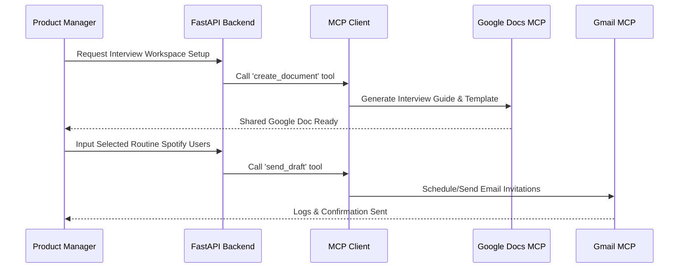

# Architecture & System Design: Spotify AI Discovery Agent

This document outlines the detailed, phase-wise system architecture and design for the **Spotify AI-Powered Music Discovery System**. It provides a roadmap mapping directly to the five key phases of our problem statement, showing how raw user reviews, user research, product requirement synthesis, an AI-native MVP, and evaluation workflows interlock using modern AI stacks and Model Context Protocol (MCP) integrations.

---

## Phase 0: Target Data Sources & Project Context

To establish the initial data foundation for the review analysis engine, the following target URLs are configured for scraping and context mapping:
- **Google Play Store**: [Spotify on Google Play Store](https://play.google.com/store/apps/details?id=com.spotify.music)
- **Product Hunt Reviews**: [Spotify Reviews on Product Hunt](https://www.producthunt.com/products/spotify/reviews)
- **Apple App Store**: [Spotify Reviews on Apple App Store](https://apps.apple.com/us/app/spotify-music-and-podcasts/id324684580?see-all=reviews&platform=iphone)

---

## 1. End-to-End System Overview

The system is designed to ingest multi-source unstructured user feedback, support PM qualitative research, auto-generate workspace documentation via MCP, and run an interactive semantic-search-based recommendation engine.

```mermaid
graph TD
    %% Users & Frontend
    User([Routine Spotify User]) -->|Natural Language Search / Feedback| UI[Vite React / Streamlit Frontend]
    PM([Product Manager]) -->|Initiate Analysis & Exporters| UI
    
    %% API & Orchestration Layer
    UI -->|API Requests| FastAPI[FastAPI Backend / Orchestrator]
    
    subgraph Data Analysis & Ingestion (Phase 1 & 2)
        FastAPI -->|Trigger Scrape| Scrapers[Scraper Service: App Store / Play Store / Reddit]
        Scrapers -->|Save Reviews| DB[(Database: SQLite / PostgreSQL)]
        DB -->|Analyze Text| Classifier[LLM Sentiment & Intent Classifier]
    end

    subgraph AI-Native Recommendation MVP (Phase 4)
        FastAPI -->|Query Vector Embeddings| ChromaDB[(Vector Database: ChromaDB)]
        FastAPI -->|Generate Search & RAG Context| LLM[LLM Agent: GPT-4o / Claude 3.5]
        FastAPI -->|Create Playlist & Fetch Tracks| SpotifyAPI[Spotify Web API]
        SpotifyAPI -->|Sync Playback & Playlists| SpotifyApp[Spotify Mobile/Web App]
    end

    subgraph Workspace Integration via MCP (Phases 2, 3, & 4)
        FastAPI -->|JSON-RPC Protocol| MCPClient[MCP Host Client]
        MCPClient -->|Write Docs / PRDs| DocsMCP[Google Docs MCP Server]
        MCPClient -->|Draft / Send Mail| GmailMCP[Gmail MCP Server]
        DocsMCP -->|Collaborative Workspace| GDocs[Google Docs]
        GmailMCP -->|Automated Feedback Loop| GMail[Gmail]
    end
```

---

## 2. Phase-Wise Architecture Breakdown

### Phase 1: Review Discovery Ingestion & Sentiment Analysis
**Goal**: Build a data pipeline to scrape, clean, categorize, and store raw user feedback to identify recommendation fatigue and algorithmic bubbles.

*   **Ingestion Component**: A FastAPI backend service exposes ingestion trigger endpoints (e.g., `POST /api/v1/ingest`). It runs background worker routines using scraping libraries (`google-play-scraper`, `app-store-scraper`) and custom Reddit/forum crawler scripts targeting `r/spotify`.
*   **Database Schema**: A relational database (SQLite for local development, PostgreSQL for production) stores the standardized review records:
    ```json
    {
      "review_id": "uuid",
      "platform": "play_store | app_store | reddit | forum",
      "rating": 2,
      "content": "I am so tired of my Discover Weekly repeating the same artists every week...",
      "timestamp": "2026-07-02T14:44:00Z",
      "processed": false
    }
    ```
*   **AI Classification Pipeline**: Unprocessed reviews are batched and classified using an LLM (e.g., Llama 3 via Groq) or a high-performance regex rule-based classifier fallback. It tags reviews with:
    *   **Sentiment**: Positive, Neutral, Negative.
    *   **Pain Point Categories**: *Algorithmic Bubble*, *Smart Shuffle Loop*, *Taste Pollution / Sandbox Need*, *Decision Paralysis*, *UI Clutter*.
    *   **Severity Index**: Numeric scale (1-5) representing churn risk.

---

### Phase 2: Qualitative User Research Validation & Workspace Integration
**Goal**: Validate the AI-detected quantitative patterns through qualitative primary user research, utilizing Model Context Protocol (MCP) to automate workspace coordination.



*   **Google Docs MCP Server Integration**: Instead of direct REST calls and complex OAuth setups, the PM orchestrator calls the Google Docs MCP server's tools (e.g., `create_document`, `append_text`) to spin up formatted structured interview guides for selected routine Spotify listeners.
*   **Gmail MCP Server Integration**: Coordinates recruitment and scheduling. Once candidates are selected, Gmail MCP automatically drafts/sends email invitations containing Calendly links and briefing documents.
*   **Transcription Logger**: As user interviews complete, the backend reads recorded transcripts and appends them to the dedicated Google Doc folder for real-time synthesis.

---

### Phase 3: Problem Definition, Business Case Synthesis, & PRD Automation
**Goal**: Formalize the target user personas, core friction, root causes, and business cases in a centralized Product Requirement Document (PRD).

*   **Sentiment Trends Aggregator**: The backend reads sentiment and pain point metrics from the DB and generates structured reports.
*   **PRD Compilation Agent**: A Groq-hosted LLM agent (e.g., Llama 3 via Groq) synthesizes the quantitative dashboard findings (from Phase 1) and the qualitative interview summaries (from Phase 2).
*   **MCP Workspace Publisher**:
    *   The agent issues commands to the **Google Docs MCP** to publish the final PRD to a shared Google Drive folder.
    *   An automatic update email is drafted via the **Gmail MCP** to notify executive stakeholders (Growth Team leadership) with direct links to the document.
    *   **Privacy & URL Constraint**: If the agent is uncertain about a query's context or origin, it will automatically scrub or refuse to attach any URLs and personal identifiable information (PII) to prevent accidental leakage in reports.

---

### Phase 4: AI-Native MVP Architecture
**Goal**: Build a conversational, context-aware discovery interface powered by LLM agentic search and RAG over acoustic metadata.

```
+-------------------------------------------------------------+
|                     Frontend User Interface                 |
|            (React / Next.js / Streamlit Client)             |
+------------------------------+------------------------------+
                               |
                   User Query  |  Tracklist & Playback
                               v
+-------------------------------------------------------------+
|                       FastAPI Backend                       |
|  +-------------------------------------------------------+  |
|  |                LLM Agentic Orchestrator               |  |
|  |           (Intent Parser & Query Generator)           |  |
|  +--------+--------------------+------------------+------+  |
|           |                    |                  |         |
|           | Search Context     | Semantic Search  | OAuth   |
|           v                    v                  v         |
|    +------------+        +------------+     +------------+  |
|    |    LLM     |        |  ChromaDB  |     |Spotify Web |  |
|    | (GPT/Groq) |        | (Vector DB)|     |    API     |  |
|    +------------+        +------------+     +------------+  |
+-------------------------------------------------------------+
```

*   **Natural Language Discovery Interface**: The frontend exposes a chat UI. Users describe moods and specific conditions (e.g., *"Upbeat synthwave without high vocals for focus"*).
*   **LLM Orchestrator (LangChain/LangGraph)**:
    1.  **Parser**: Extracts musical elements, valence, speed, and lyric sentiments.
    2.  **Vector Search Engine**: Translates parsed criteria into dense vector representations. Queries **ChromaDB** containing track metadata and embeddings.
    3.  **Refinement Loop**: Handles multi-turn refinement (e.g., *"Make it a bit slower,"* *"Add more acoustic guitars"*).
*   **Spotify API Bridge**: Resolves Spotify OAuth credentials to create playable playlists directly in the user's library and trigger player SDK controls.
*   **Workspace Feedback Sync**: When users export playlists, an event triggers. **Gmail MCP** schedules a feedback survey 24 hours later, and replies are aggregated into Google Docs via **Google Docs MCP**.

---

### Phase 5: Evaluation & Production Cloud Deployment
**Goal**: Package, deploy, and evaluate the performance of the discovery system in production.

*   **Production Hosting (Railway)**:
    *   **Docker Containerization**: FastAPI backend and Streamlit/React frontend are built as separate containers.
    *   **Deployment Configuration**: Multi-service architecture managed via `railway.json`.
*   **Success Metrics Registry**:
    *   *Search Precision*: LLM eval score comparing user text query intent to returned tracks' acoustic characteristics.
    *   *Catalog Coverage*: Measure of unique tracks/artists recommended versus traditional collaborative filtering.
    *   *Active Engagement*: Click-through rates (CTR) on AI-generated playlists and skip rates of the tracks within them.

---

## 3. Security, Credentials, and Data Boundaries

*   **Delegated Authentication**: By relying on local/cloud instances of MCP servers (Google Docs/Gmail MCP), the application backend delegates OAuth lifecycle management to the MCP host runtime. This keeps Google API secrets separate from application code.
*   **Spotify OAuth 2.0**: The application implements standard PKCE (Proof Key for Code Exchange) OAuth flows to obtain user consent, storing Spotify access/refresh tokens in encrypted session cookies.
*   **Sandbox / Offline Mode**: The system provides environment flags (e.g., `WORKSPACE_MODE=offline`) that bypass Google/Spotify APIs, logging outputs to `data/workspace/` and mock Spotify JSON nodes to facilitate local unit testing.

---

## 4. Automated Operations & Data Refresh (GitHub Actions Scheduler)

To keep the recommendation database updated with real-time feedback without manual intervention, a **GitHub Actions Cron Workflow** is configured:
1. **Trigger**: Scheduled via `POSIX cron` to run daily (e.g., `0 0 * * *`) or manually triggered on-demand via `workflow_dispatch`.
2. **Ingestion Job**: The runner executes `python src/phase1/ingest_reviews.py` to pull the latest Google Play Store and Apple App Store reviews, filters them (English only, >6 words), and saves them to the relational database.
3. **Sentiment & Vector Rebuilding**: The workflow triggers `python src/phase4/seed_tracks.py` to rebuild vector embeddings in ChromaDB, ensuring new tracks and refreshed user comments are instantly discoverable in semantic search.
4. **Staging Deploy Trigger**: Once the data is successfully updated and all precision/coverage tests pass, a webhook triggers a rolling redeployment on Railway to push the fresh vector database to production.

