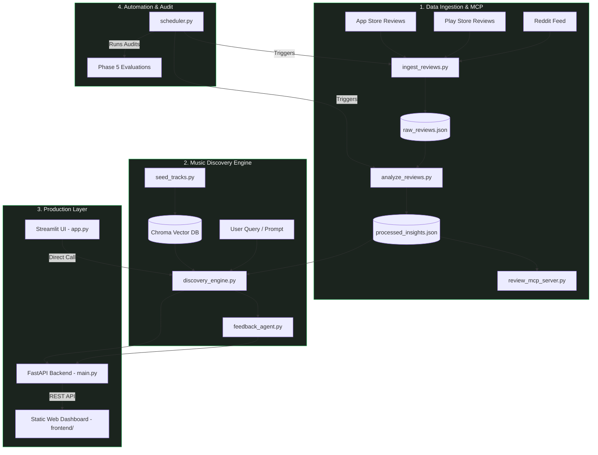
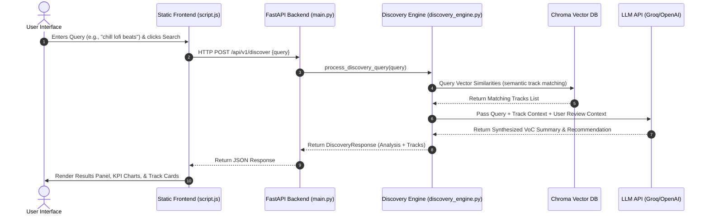
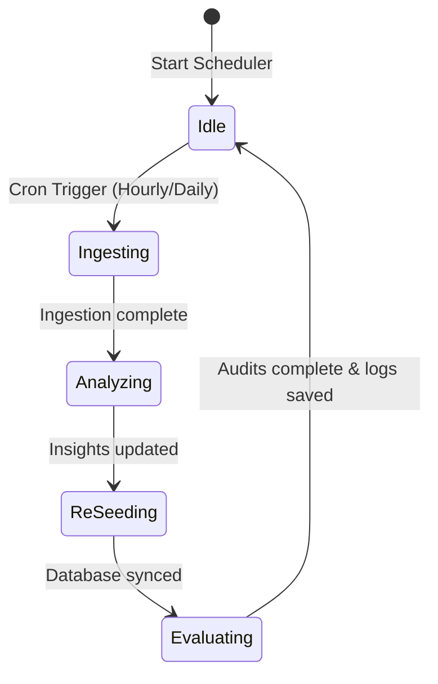

# Spotify Review Discovery Engine: Project Workflow

This document outlines the end-to-end workflow, data pipelines, and architectural components of the **Spotify Review Discovery Engine**. The engine integrates voice-of-the-customer (VoC) sentiment analysis with LLM-powered semantic music recommendation.

---

## 1. System Architecture Overview

The system is organized into a layered pipeline: **Ingestion**, **Vector Seeding**, **Discovery & Refinement**, **Production APIs**, and **Continuous Evaluation**.

---

## 2. Phase-by-Phase Workflow

### Phase 1: Ingestion & Analysis Pipeline
1.  **Ingestion (`ingest_reviews.py`)**: Fetches raw user reviews from Apple App Store, Google Play Store, and Reddit threads. Saves the compiled logs into `data/raw_reviews.json`.
2.  **Analysis (`analyze_reviews.py`)**: Parses the raw texts to extract sentiment scores, core themes (e.g., UI updates, repetitiveness, bugs), and user requests. Saves the results to `data/processed_insights.json`.
3.  **MCP Integration (`review_mcp_server.py`)**: Exposes reviews as a Model Context Protocol tool, enabling agents and LLMs to query active user sentiment reports dynamically.

### Phase 2: PRD & Competitive Synthesis
1.  **Market Research (`stage_research.py`)**: Automates gathering competitor data and feature parity charts (e.g., Apple Music Lossless, YouTube Music cover catalogs).
2.  **PRD Generation (`synthesize_prd.py`)**: Compiles product requirement logs based on gaps found in user reviews and competitive audits.

### Phase 3: Concept Prototyping
- Contains the initial architecture schemas and mock endpoints used to structure backend contracts.

### Phase 4: Discovery Engine Core
1.  **Database Seeding (`seed_tracks.py`)**: populates the Chroma vector database (`data/chroma_db/`) with a catalog of songs, generating embeddings for track descriptions, tempos, and metadata.
2.  **AI Engine (`discovery_engine.py`)**: Fuses vector similarities with review data context. It executes queries on the vector database and formats LLM completion prompts (via Groq/OpenAI) to match tracks against user intentions.
3.  **Feedback Agent (`feedback_agent.py`)**: Operates a stateful session refinement loop, allowing users to modify search intents (e.g., *"Make it more energetic"* or *"Include only acoustic tracks"*).
4.  **Spotify Authorization (`spotify_auth.py`)**: Interfaces with Spotify API OAuth to allow users to sync search results as custom Spotify playlists.

### Phase 5: Evaluation & Auditing
Runs test jobs to verify pipeline safety and quality:
*   `evaluate_catalog_coverage.py`: Audits track distribution across searches.
*   `evaluate_search_precision.py`: Evaluates semantic matching precision.
*   `evaluate_security.py`: Tests against prompt injections and system leaks.
*   `evaluate_load_test.py`: Measures backend API response times under simulated request loads.

---

## 3. Production Request Lifecycle

The diagram below outlines a user search request lifecycle, demonstrating how the static HTML/JS/CSS frontend communicates with the FastAPI backend and AI engines:

---

## 4. Automation & Maintenance

The system is automated via the background process `scheduler.py`:

*   **Ingesting**: Fetches new reviews.
*   **Analyzing**: Re-runs VoC classification.
*   **ReSeeding**: Integrates database updates.
*   **Evaluating**: Re-runs evaluation suites (`catalog coverage`, `search precision`, `security audit`) to ensure updates did not introduce regressions.
